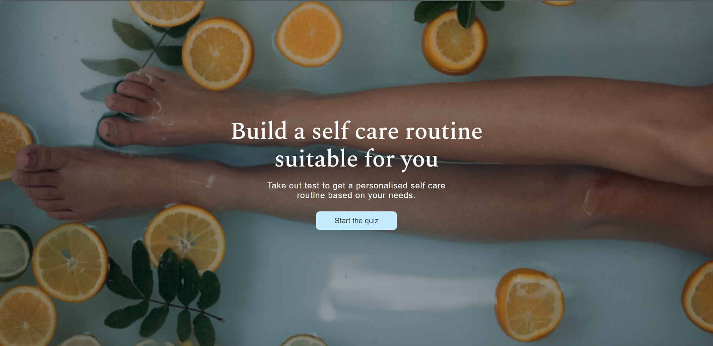
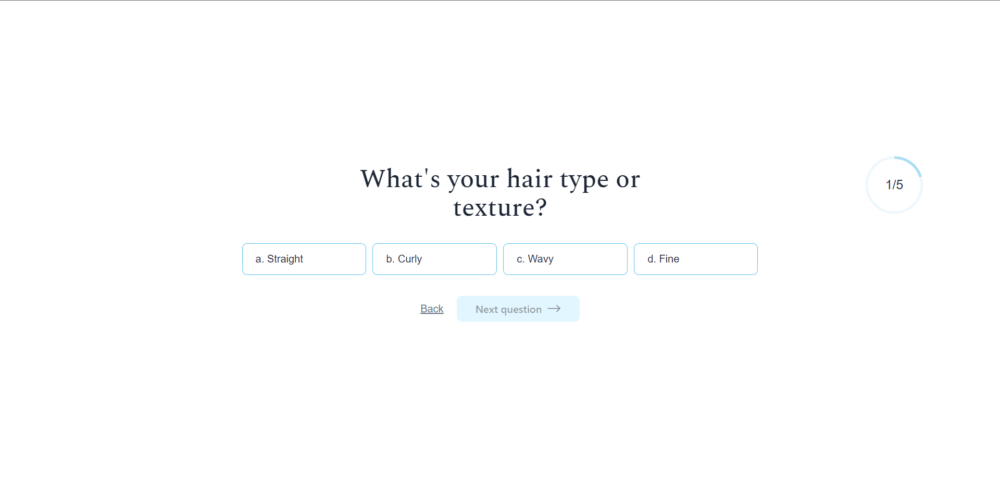
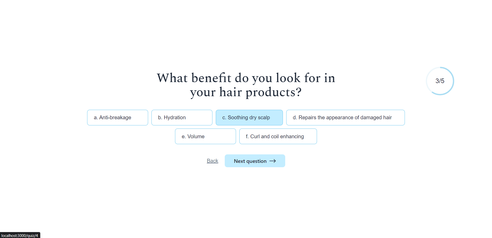
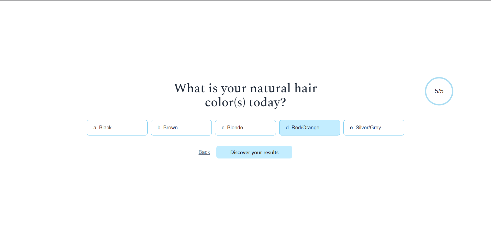
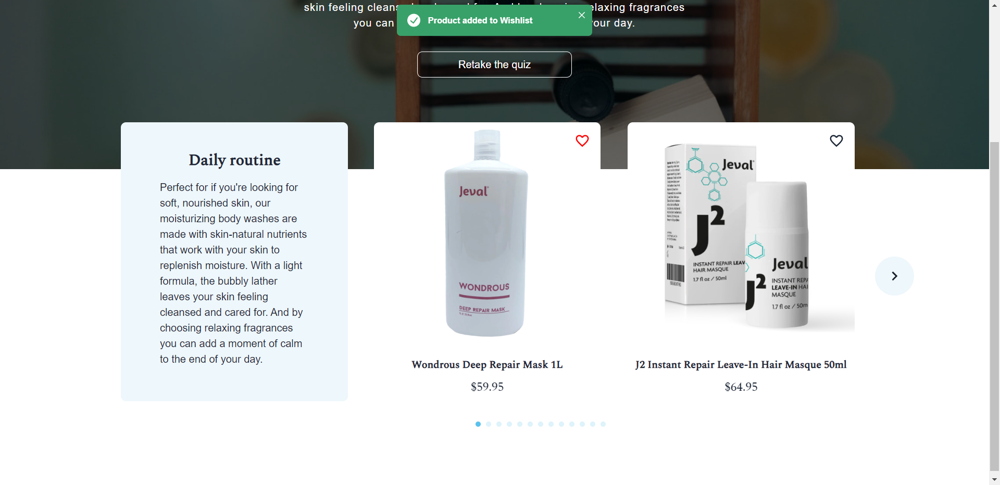

# Routine-Finder-Quiz
# Running the project locally

1. Clone the branch to your computer.
2. Run `npm install` in the terminal to install all required dependencies.
3. Run `npm start` in the terminal to run the project locally.
4. Open the following link to see the project if it hasn't opened automatically: http://localhost:3000/.
------------------------------------------------------------------------------------------------------------------------------------------

You can:
- start the quiz
- answer questions
- get personalized products based on the given answers
- add to wishlist
- remove from wishlist
- retake quiz

# 💻Technologies

 - ReactJS
 - Chakra UI

# 👀Screenshots

</img>
</img>
</img>
</img>
</img>
</img>

# 🏆Feedback 

Thank you for viewing my project. If you have any questions, please dm me.
